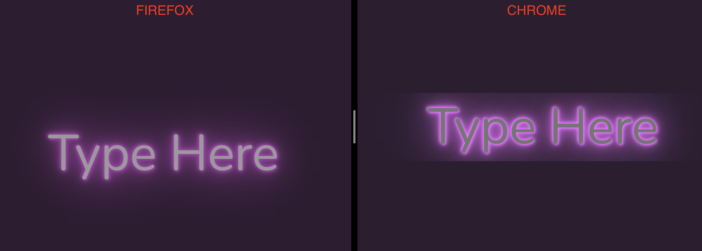

# CSS Browser Comparison

## Description

Have you ever been working on CSS and said to yourself "Hell yeah this looks INCREDIBLE!!!" only to see your project look like garbage on another browser? If so, you're not alone. Depending on the visuals you're trying to achieve, it can sometimes take hours of extra time making the styling look cohesive between browsers.
 
 
This small project was designed to illustrate how drastic these differences can be. Chrome appears to restrict text shadows inside inputs, while Firefox appears to be unrestricted. The most drastic difference I noticed is how the placeholders are styled.
 
 
Bear in mind that this only serves as a brief example between two browsers on a laptop (and only one version of each browser). The main takeaway is to ALWAYS test your project on more than one browser, because you never know what strange things might be happening.
 
 
PLACEHOLDER:

 
 
USER INPUT:

